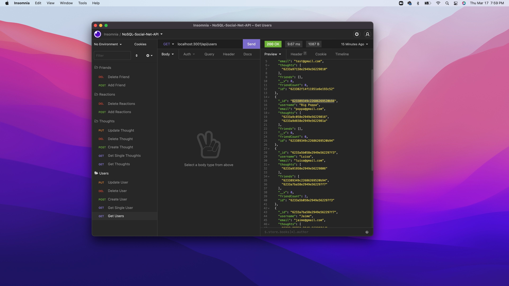

# NoSQL-Social-Net-API

## Description:
This application demonstrates the functionality of a backend web app, using insomnia to show the routes of CRUD operations. This would allow us to create users, update users, delete users and get a list of all users. This app also allows up to create thoughts for users and update older thoughts and delete thoughts and get all thoughts. We can also add reactions to a specific persons thought and as well delete that reaction another functionality to the app is that we can add friends to each other and delete friends. 

## Table of Contents:

-- [Usage](#usage)

-- [Installation](#installation)

-- [License](#license)

-- [Contributors](#contributors)

-- [Github User Name](#Github-User-Name)

-- [Email](#email)

-- [Test](#test)

## Usage:

Here is a link to a [demo](https://vimeo.com/689498039/b491c61edd)

## Installation:
With the code downloaded you can run the integrated terminal and type the code: npm i to install any packages that are needed, and then you can run the code to start the server with nodemon server.js or node server.js. Now you can see the functionality in the Insomnia app. 
## License:

 [License: MIT](https://opensource.org/licenses/MIT)
Permission is hereby granted, free of charge, to any person obtaining a copy of this software and associated documentation files (the "Software"), to deal in the Software without restriction, including without limitation the rights to use, copy, modify, merge, publish, distribute, sublicense, and/or sell copies of the Software, and to permit persons to whom the Software is furnished to do so, subject to the following conditions: The above copyright notice and this permission notice shall be included in all copies or substantial portions of the Software. THE SOFTWARE IS PROVIDED "AS IS", WITHOUT WARRANTY OF ANY KIND, EXPRESS OR IMPLIED, INCLUDING BUT NOT LIMITED TO THE WARRANTIES OF MERCHANTABILITY, FITNESS FOR A PARTICULAR PURPOSE AND NONINFRINGEMENT. IN NO EVENT SHALL THE AUTHORS OR COPYRIGHT HOLDERS BE LIABLE FOR ANY CLAIM, DAMAGES OR OTHER LIABILITY, WHETHER IN AN ACTION OF CONTRACT, TORT OR OTHERWISE, ARISING FROM, OUT OF OR IN CONNECTION WITH THE SOFTWARE OR THE USE OR OTHER DEALINGS IN THE SOFTWARE.

## Contributors:

Me.

## Github User Name:

Here is a link to my Github: https://github.com/GundamMosi10

## Email:

If you have any questions or would like to get in contact with me you can email me at this address: cargile10@gmail.com

## Test:

There are no tests associated with this project.
